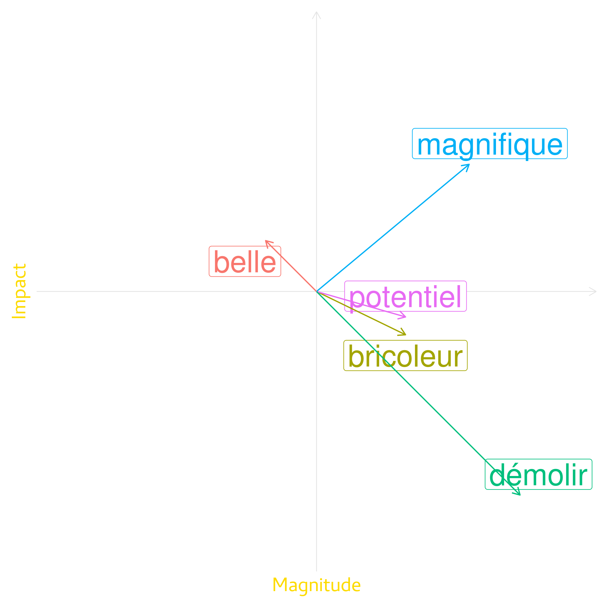
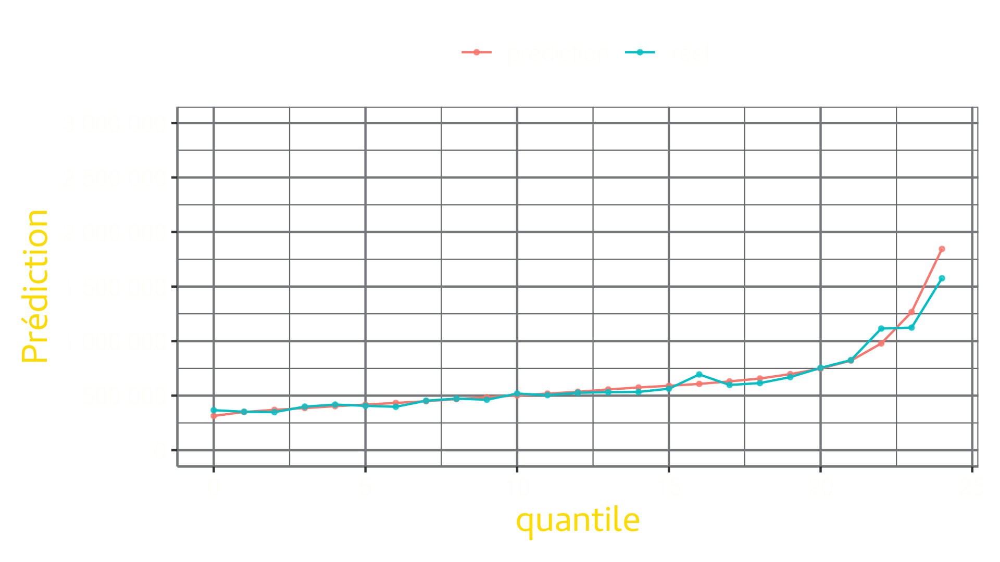

```{r setup, include=FALSE}

PROMU_YELLOW <- "#fddb00"
PROMU_GREY = "#53565A"

library(kableExtra)
library(gt)
library(tidyverse)
library(tidymodels)
library(gtExtras)
library(xaringanthemer)

source("./src/functions.R")

```


```{r theme, include=FALSE}

PROMU_YELLOW = "#FDDB00"
#PROMU_GREY = "#adafb2"
PROMU_GREY = "#53565A"

options(htmltools.dir.version = FALSE)
knitr::opts_chunk$set(
  fig.path = "media/",
  fig.width = 15,
  fig.height = 100/15,
  fig.retina = 3,
  out.width = "100%",
  cache = FALSE,
  echo = FALSE,
  message = FALSE, 
  warning = FALSE,
  fig.showtext = FALSE,
  fig.align = "center",
  hiline = TRUE,
  dev.args = list(bg = "transparent")
)
style_duo(
  primary_color = PROMU_GREY,
  secondary_color = PROMU_YELLOW,
  title_slide_background_image = "media/logo.svg",
  title_slide_background_size = "320px",
  title_slide_background_position = "10% 90%",
  text_font_google = google_font("Roboto"),
  header_font_google = google_font("Roboto Condensed")
)

```


# Jeu de données


```{r}
read_rds("./data/assets/tbl_raw_data.rds") %>% 
  add_gt_tab_options()
```

---


class: center middle
# Premier modèle

---

## Premier modèle - Définition

```{r}
read_rds("./data/assets/tbl_raw_data.rds") %>% 
  tab_spanner(label = "Réponse", columns = 1) %>% 
  tab_spanner(label = "Prédicteurs", columns = 2:10) %>% 
  tab_style(
    cell_fill(color = "#FFFFFF00", alpha = 0.9),
    locations = list(cells_column_spanners())
  ) %>%
  tab_style(
    cell_fill(color = "#DDDDDD00", alpha = 0.9),
    locations = list(cells_body(columns = 1:10), cells_column_labels(columns = 1:10), cells_column_spanners())
  ) %>%
  tab_style(
    cell_fill(color = PROMU_YELLOW, alpha = 0.9),
    locations = list(cells_body(columns = 1), cells_column_labels(columns = 1), cells_column_spanners(spanners = 1))
  ) %>%
  add_gt_tab_options()
```

---


## Premier modèle - Résultats

```{r, out.height=550, out.width = 1000}
knitr::include_graphics("./data/assets/plot_vip_model1.png")
```

---


## Premier modèle - Performance

```{r, out.height=550, out.width = 1000}
knitr::include_graphics("./data/assets/plot_lift_model1.png")
```

---

## Premier modèle - Performance

```{r, out.height=550, out.width = 1000}
knitr::include_graphics("./data/assets/plot_lift_error_model1.png")
```

---


class: center middle
# Traitement de la description

???

Très riche en information, mais comme ce n'est pas structuré, les algorithmes de machine learning ne peuvent la traiter directement

---

## 


## Indicateur de mot clé

Identifier certains mots clés qui ont une influence sur le prix et faire des indicateurs de présence de ceux-ci dans la description.


```{r}
tbl_keywords <- tribble(
  ~keyword, ~dir,
  "Bricoleur", "arrow-down",
  "Potentiel", "arrow-down",
  "Rénové", "arrow-up",
  "Spacieux", "arrow-up"
) %>% 
  gt() %>% 
  cols_label(
    keyword = "Mon clé",
    dir = "Effet attendu"
  ) %>% 
  gt_fa_column(column = dir,
               palette = c("arrow-down" = "#E45252",
                           "arrow-up" = "#9BE452")) %>% 
  cols_align(align = "center",
             columns = dir) %>% 
  tab_style(
    style = list(
      cell_fill(color = "#FFFFFF00", alpha = 0.9)
    ),
    locations = list(cells_body(), cells_column_labels(), cells_column_spanners())
  )

tbl_keywords
```

---


## Indicateur de mot clé - Enjeux

* Ignore le contexte du mot clé:

```{r}
tribble(
  ~description, ~indicateur,
  "Complètement rénovée en 2022", "oui",
  "Devra être rénovée en entier", "oui"
) %>%   
  gt() %>% 
  cols_align(align = "center",
             columns = indicateur) %>% 
  tab_style(
    style = list(
      cell_fill(color = "#FFFFFF00", alpha = 0.9)
    ),
    locations = list(cells_body(), cells_column_labels(), cells_column_spanners())
  )
```

--

* Difficile de traiter les synonymes, mots rares et/ou erreurs de frappe

--
* Laborieux d'identifier les mots clé


---


## Vectorisation de mots

Idée générale:

* Techniques utilisées pour de représenter un mot sous la forme d'un vecteur à *n* dimension
* Les mots qui sont similaire pour la tâche donné vont avoir un vecteur similaire

???

C'est la technique qui est utilisée par les algorithme d'intelligence artificielle comme chatGPT pour traiter le text entré par les utilisateurs

---

## Vectorisation de mots

```{r, out.height=500, out.width = 500}

```

???

En réalité, les dimension crées par ces modèles ne sont pas interprétable

---

## Vectorisation de mots

```{r, out.height=450, out.width = 600}

```

---

## Vectorisation de mots

2 options:

1. Modèle entraîné spécifiquement pour la tâche voulue
2. Utilisé un modèle général 

???

Le modèle d'openAI est fait pour mesurer la relation entre les mots dans le texte courant

Les mots sont transformés en vecteur de 1536 dimensions

---

## Vectorisation de mots

```{r}
read_rds("./data/assets/tbl_embeddings.rds") %>% 
  add_gt_tab_options()
```

---


class: center middle
# Deuxième modèle
## Description uniquement

---

## Deuxième modèle - Résultats

```{r, out.height=550, out.width = 1000}

```

---


## Deuxième modèle - Performance

```{r, out.height=550, out.width = 1000}

```

---

## Deuxième modèle - Performance

```{r, out.height=550, out.width = 1000}
knitr::include_graphics("./data/assets/plot_dbl_lift_model_embed.png")
```

---


## Deuxième modèle - Analyse

--

.pull-left[

```{r}
read_rds("./data/assets/tbl_top_words_low.rds") %>% 
  add_gt_tab_options()
```
]


.pull-right[

```{r}
read_rds("./data/assets/tbl_top_words_high.rds") %>% 
  add_gt_tab_options()
```
]

---

## Deuxième modèle - Performance

```{r, out.height=550, out.width = 1000}

```

---


class: middle center
# Modèle final

---


## Modèle final - Résultats


```{r, out.height=550, out.width = 1000}

```


## Modèle final - Performance


```{r, out.height=550, out.width = 1000}

```


---


## Modèle final - Performance


```{r, out.height=550, out.width = 1000}

```

---


## Modèle final - Performance


```{r, out.height=550, out.width = 1000}
knitr::include_graphics("./data/assets/plot_dbl_lift_model_final.png")
```

---


## Modèle final - Analyse


```{r, out.height=550, out.width = 1000}
read_rds("./data/assets/tbl_avec_vs_sans_description.rds")
```

---


